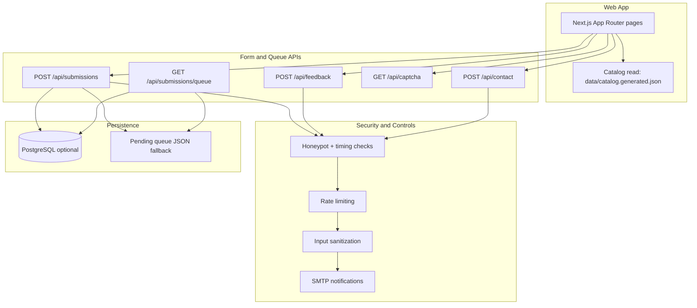

# Know Your IT Hub

Know your company type before you apply.

[](https://github.com/nuthanm/knowyourcompanytype/actions/workflows/ci.yml)
[](https://nextjs.org/)
[](https://www.typescriptlang.org/)
[](https://react.dev/)
[](https://tailwindcss.com/)
[](https://zod.dev/)
[](https://www.postgresql.org/)
[](https://vercel.com/)
[](LICENSE)

Site: https://knowyourithub.com


## Purpose

Job seekers, especially people switching companies, often find scattered or vague information when comparing potential employers. This project gives a minimal, useful, and source-linked company view so visitors can decide faster and with less noise.

Core goal:

- Show only useful details that help career decisions.
- Keep the catalog verifiable with citations.
- Make community corrections easy through submit and feedback workflows.

## Problem We Solve

- Company type (product, service, hybrid) is often unclear on job portals.
- Public discussions can be outdated, opinionated, or not source-backed.
- Candidates need one place with consistent structure and clear verification status.

## What Visitors Get

- Searchable company profiles with category and verification status.
- Source-linked profile fields and data freshness metadata.
- Progress indicators for verified, in-progress, and awaiting-review entries.
- Submit and feedback forms for corrections and additions.

## Tech Stack

### Application

- Next.js 16 (App Router)
- React 19
- TypeScript 5
- Tailwind CSS 4

### Validation, Security, and Delivery

- Zod for schema validation
- Math CAPTCHA + anti-bot checks + rate limiting
- Nodemailer for notifications
- Vercel for deployment

### Storage

- PostgreSQL `company_profiles`, with one row per catalog company
- data/catalog.generated.json as the build-time catalog cache pulled from PostgreSQL
- data/companies.json for active portal submissions only (`awaiting_review` / `in_progress`)
- Optional PostgreSQL storage for submissions
- Local JSON-backed queue fallback for development; production review queues require PostgreSQL or Upstash Redis
- Optional PostgreSQL snapshots for catalog distribution to keep repo data private

## Architecture



## Behaviour flow

### Flow 1 — submit and queue a request

Files involved:
- [app/api/submissions/route.ts](app/api/submissions/route.ts) or the submit handler entry point
- [lib/api/submit-handler.ts](lib/api/submit-handler.ts)
- [lib/submissions.ts](lib/submissions.ts)
- [lib/pending-queue-store.ts](lib/pending-queue-store.ts)
- [lib/subscribers.ts](lib/subscribers.ts)
- [data/companies.json](data/companies.json)

Behavior:
- A visitor submits an add or edit request from the portal.
- The request is validated, sanitized, and checked for duplicate or already-known companies.
- The record is inserted into the review queue (`company_submissions`) with status `awaiting_review`.
- The same request also appears in the local pending queue JSON fallback or the DB-backed queue.
- The item is shown on the review page as awaiting review until a maintainer confirms the record.
- If the submitter opts in, their email is stored in `catalog_subscribers` and they receive the welcome email.

### Flow 2 — enrich and move to in progress

Files involved:
- [lib/submissions.ts](lib/submissions.ts)
- [lib/catalog-drafts.ts](lib/catalog-drafts.ts)
- [lib/email-templates.ts](lib/email-templates.ts)
- [app/api/submissions/queue/status/route.ts](app/api/submissions/queue/status/route.ts)
- [data/companies.json](data/companies.json)
- [data/catalog.generated.json](data/catalog.generated.json)

Behavior:
- A maintainer opens the queue and updates the company record with verified details.
- The queue status moves from `awaiting_review` to `in_progress`.
- The code keeps the queue row active and syncs the draft record into the local queue/profile review file.
- The profile stays in a pending state with `verificationStatus` set to `in_progress` until final verification is complete.
- The notification email is sent only to the original submitter for `in_progress`, not to all subscribers.
- This matches the handwritten flow from the note: it is a personal update to the submitter during verification.

### Flow 3 — verified company goes live

Files involved:
- [lib/submissions.ts](lib/submissions.ts)
- [lib/email-templates.ts](lib/email-templates.ts)
- [scripts/sync-companies-db.mjs](scripts/sync-companies-db.mjs)
- [scripts/catalog-push-db.mjs](scripts/catalog-push-db.mjs)
- [scripts/catalog-pull-db.mjs](scripts/catalog-pull-db.mjs)
- [data/catalog.generated.json](data/catalog.generated.json)
- [data/companies.json](data/companies.json)

Behavior:
- Once approval is complete, the queue item is set to `verified`.
- The verified company is removed from the review queue and added to the published catalog.
- The canonical profile is kept in PostgreSQL `company_profiles` and mirrored into the generated catalog used by the website.
- A broadcast email is sent to all active subscribers for the verified company update.
- The URL should resolve to the final company details route such as `/companies/<slug>`.

### Status mapping used by the project

This project intentionally separates queue status from catalog profile status:

- Queue status: `awaiting_review`, `in_progress`, `verified`, `rejected`
- Catalog/profile status: `unverified`, `in_progress`, `verified`

The mapping is:

- `awaiting_review` -> `unverified`
- `in_progress` -> `in_progress`
- `verified` -> `verified`

This keeps the admin review queue clean while still allowing the public catalog to show a simple status model.

### Current code alignment

The code was previously broadcasting every non-rejected status update to all subscribers. That was not aligned with the handwritten flow.

The logic has been corrected so that:

- `in_progress` sends a mail only to the original submitter
- `verified` sends a mail to all subscribers
- `awaiting_review` does not broadcast to all subscribers

The notification behavior is now aligned with the three flow stages described above.

### Operational controls

- Rate limiting for abuse prevention.
- Honeypot/timing bot detection.
- CAPTCHA challenge token verification.
- Input sanitization and suspicious-character rejection.
- CORS handling for cross-origin safety.

This project intentionally separates queue status from catalog profile status:

- Queue status: `awaiting_review`, `in_progress`, `verified`, `rejected`
- Catalog/profile status: `unverified`, `in_progress`, `verified`

The mapping is:

- `awaiting_review` -> `unverified`
- `in_progress` -> `in_progress`
- `verified` -> `verified`

This keeps the admin review queue clean while still allowing the public catalog to show a simple status model.

### Current code alignment

The code was previously broadcasting every non-rejected status update to all subscribers. That was not aligned with the handwritten flow.

The logic has been corrected so that:

- `in_progress` sends a mail only to the original submitter
- `verified` sends a mail to all subscribers
- `awaiting_review` does not broadcast to all subscribers

The notification behavior is now aligned with the three flow stages described above.

### Operational controls

- Rate limiting for abuse prevention.
- Honeypot/timing bot detection.
- CAPTCHA challenge token verification.
- Input sanitization and suspicious-character rejection.
- CORS handling for cross-origin safety.

## Company Data Process

The canonical catalog is stored as one row per company in PostgreSQL `company_profiles`.
`data/catalog.generated.json` is the build-time cache reconstructed from those rows.
`data/companies.json` is intentionally small: it contains only active portal submissions that are
awaiting review or in progress.

Typical workflow:

1. Draft a company profile (optionally via enrichment scripts).
2. Validate details against official sources.
3. Set category, verification status, and source links.
4. Update lastVerified and related metadata.
5. Merge into catalog and deploy.

Helper scripts (examples):

- npm run enrich:wikidata -- "Company Name" slug
- scripts/merge-enrichments.mjs
- scripts/fill-remaining-gaps.mjs

## Local Setup

```bash
npm install
cp .env.example .env.local
npm run dev
```

Open http://localhost:3000

### Local testing workflow

1. Start the app locally:
   ```bash
   npm run dev
   ```
2. Open the submit form on `/submit` and create a company request.
3. Confirm the submission is stored in the review queue and visible on `/coming-soon`.
4. Update the queue status via the moderation console or API.
5. Test the three stages:
   - `awaiting_review` shows the item in the review queue
   - `in_progress` sends a direct email to the submitter only
   - `verified` pushes the company to the catalog and broadcasts to all subscribers
6. Check the generated catalog and queue JSON files after each status change.

### Local moderation API examples

```bash
curl -X POST http://localhost:3000/api/submissions/queue/status \
  -H "Content-Type: application/json" \
  -H "Authorization: Bearer <ADMIN_API_KEY>" \
  -d '{
    "id": "<submission-id>",
    "status": "in_progress",
    "companyName": "Newgen Software",
    "companySlug": "newgen-software"
  }'
```

For a verified transition:

```bash
curl -X POST http://localhost:3000/api/submissions/queue/status \
  -H "Content-Type: application/json" \
  -H "Authorization: Bearer <ADMIN_API_KEY>" \
  -d '{
    "id": "<submission-id>",
    "status": "verified",
    "companyName": "Newgen Software",
    "companySlug": "newgen-software"
  }'
```

## Environment and Deployment

- Deploy target: Vercel
- Environment template: .env.example
- Production review queue persistence: configure PostgreSQL via DATABASE_URL, or both Upstash variables
- Local-only queue fallback: JSON file storage when neither persistence provider is configured
- Optional API hardening: ADMIN_API_KEY and CORS origins
- Review queue moderation: set REVIEW_QUEUE_PASSCODE (or use ADMIN_API_KEY as its fallback)
- Optional strict deployment gate: CATALOG_DB_REQUIRED=1

## Local-to-DB sync and deployment sync

### Local sync model

The project uses two layers:

1. Local JSON files for rapid local dev and fallback persistence
2. PostgreSQL for durable catalog and queue state in production or when DATABASE_URL is configured

The local files are:

- `data/companies.json` — active queue/profile draft entries and pending review entries
- `data/catalog.generated.json` — published catalog snapshot used by the app
- `data/pending.json` — fallback queue used when DB is not available

The DB tables are:

- `company_submissions` — review queue rows
- `company_profiles` — canonical, verified catalog rows
- `catalog_subscribers` — subscriber email list
- `company_catalog_metadata` — catalog snapshot metadata

### How sync works

#### Pull latest DB data into local files

```bash
npm run catalog:pull-db
```

This pulls the latest `company_profiles` rows into `data/catalog.generated.json`.

If you want the build to fail when the DB catalog is missing, use:

```bash
CATALOG_DB_REQUIRED=1 npm run catalog:pull-db:required
```

#### Push local catalog to DB

```bash
npm run catalog:push-db
```

This writes the content from `data/catalog.generated.json` or the legacy `data/companies.json` file into PostgreSQL `company_profiles` and updates `company_catalog_metadata`.

#### Sync the queue and catalog state after verification

```bash
npm run companies:sync-db
```

This syncs the verified catalog rows into `company_profiles` and marks matching submissions in `company_submissions` as `verified`.

### After pushing changes to the repo

1. Push the branch to GitHub.
2. Deploy to Vercel.
3. On deploy, the app runs `prebuild` which calls `scripts/catalog-pull-db.mjs --build`.
4. If `DATABASE_URL` is configured and `CATALOG_PULL_ON_BUILD=true`, the build pulls the latest published catalog snapshot into `data/catalog.generated.json`.
5. The deployed app reads the pull result and serves the latest verified profile data.

This means the production app is consistently driven by the DB-backed catalog, while local dev can operate from the JSON fallback when the DB is missing or intentionally disabled.

### Recommended local workflow for maintainers

```bash
cp .env.example .env.local
npm install
npm run dev
```

Then:

- submit a company from the UI
- review it in the moderation queue
- change the queue status from `awaiting_review` to `in_progress`
- verify it as `verified`
- run `npm run companies:sync-db` to ensure DB and catalog data remain in sync
- push the branch and redeploy when you want the public site to pick up the latest catalog snapshot

Catalog sync commands:

- npm run catalog:migrate-to-rows (one-time, backup-first migration from the legacy catalog)
- npm run catalog:push-db
- npm run catalog:pull-db
- npm run catalog:pull-db:required
- npm run companies:sync-db

Build behavior:

- npm run build runs prebuild automatically.
- prebuild executes catalog pull from DB when DATABASE_URL is configured.
- If DB is not configured or `company_profiles` is missing, pull is skipped (non-breaking).
- If data/catalog.generated.json is missing, prebuild auto-creates it from data/companies.example.json.
- If CATALOG_DB_REQUIRED=1, build fails when the row-based catalog pull cannot complete.

Catalog row schema:

- db/catalog.sql
- db/companies.sql
- db/submissions.sql

Pull request database sync workflow:

- GitHub Actions workflow: .github/workflows/companies-db-sync.yml
- Triggers on pull requests that touch data/companies.json
- Runs only when data/companies.json exists in the workspace
- Syncs catalog rows into company_profiles and marks matching submissions as verified

## Data Visibility and Private Catalog Guidance

Important: data inside tracked files is public in git history when pushed.

If your catalog must stay private, use this approach:

1. Keep sensitive catalog in an untracked private file (for example data/companies.private.json).
2. Add private file patterns to .gitignore.
3. Commit only a sanitized sample file for public repositories.
4. If data was already committed, rotate/move sensitive values and rewrite history if legally required.

Current repository note:

- This codebase reads verified profiles from data/catalog.generated.json and active review entries from data/companies.json.
- To fully hide catalog content from public viewers, you must stop tracking sensitive data files and publish only sanitized data.

### Zero-Downtime rollout (recommended)

1. Apply DB schema:
  - Run db/catalog.sql on production PostgreSQL.
2. Push current catalog snapshot to DB:
  - npm run catalog:push-db
3. Set production env CATALOG_DB_REQUIRED=1.
4. Deploy application (prebuild pulls active snapshot into data/companies.json at build time).
5. Validate catalog pages and search in production.
6. After validation, remove tracked catalog from git history policy:
  - Keep data/companies.json gitignored.
  - Untrack existing file once team is ready: git rm --cached data/companies.json

For local/public development without private data:

- Keep data/companies.example.json in repo.
- prebuild will use it only when data/companies.json is absent.

This order avoids downtime because existing app behavior remains unchanged while source-of-truth transitions to DB.

## Attribution and Disclosures

- Community-maintained directory; not affiliated with listed companies.
- Information can change over time; always cross-check with official sources before making career decisions.
- External references and brand names belong to their respective owners.
- This platform is informational and does not guarantee hiring outcomes.

## Copyright

Copyright (c) 2026 Nuthan Murarysetty.
All trademarks and company names referenced in profiles remain property of their respective owners.

## License and Forking Clarification

This repository currently includes an MIT license in LICENSE.

If your intent is to prevent others from forking/reusing code, MIT is not suitable. You should replace LICENSE with a restrictive/proprietary license before publishing that policy.

Until LICENSE is changed, usage rights are governed by the current LICENSE file.
