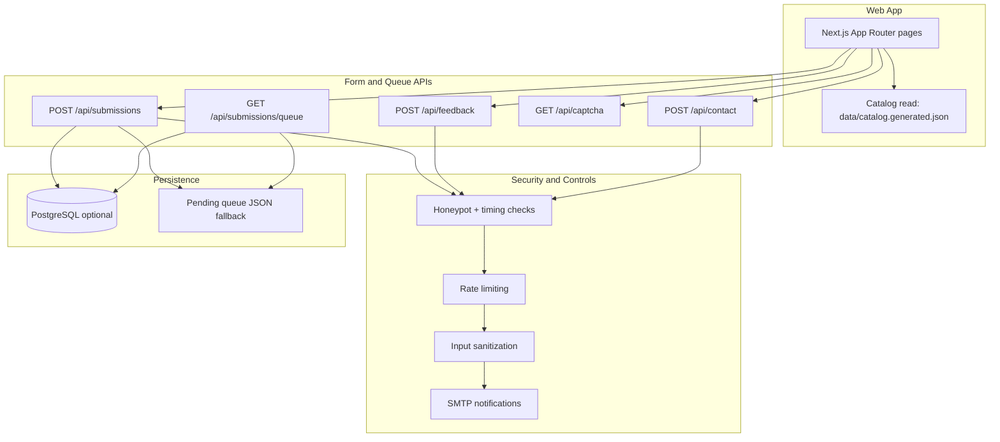

# Know Your IT Hub

Know your company type before you apply.

[](https://github.com/nuthanm/knowyourcompanytype/actions/workflows/ci.yml)
[](https://nextjs.org/)
[](https://www.typescriptlang.org/)
[](https://react.dev/)
[](https://tailwindcss.com/)
[](https://zod.dev/)
[](https://www.postgresql.org/)
[](https://vercel.com/)
[](LICENSE)

Site: https://knowyourithub.com


## Purpose

Job seekers, especially people switching companies, often find scattered or vague information when comparing potential employers. This project gives a minimal, useful, and source-linked company view so visitors can decide faster and with less noise.

Core goal:

- Show only useful details that help career decisions.
- Keep the catalog verifiable with citations.
- Make community corrections easy through submit and feedback workflows.

## Problem We Solve

- Company type (product, service, hybrid) is often unclear on job portals.
- Public discussions can be outdated, opinionated, or not source-backed.
- Candidates need one place with consistent structure and clear verification status.

## What Visitors Get

- Searchable company profiles with category and verification status.
- Source-linked profile fields and data freshness metadata.
- Progress indicators for verified, in-progress, and awaiting-review entries.
- Submit and feedback forms for corrections and additions.

## Tech Stack

### Application

- Next.js 16 (App Router)
- React 19
- TypeScript 5
- Tailwind CSS 4

### Validation, Security, and Delivery

- Zod for schema validation
- Math CAPTCHA + anti-bot checks + rate limiting
- Nodemailer for notifications
- Vercel for deployment

### Storage

- PostgreSQL `company_profiles`, with one row per catalog company
- data/catalog.generated.json as the build-time catalog cache pulled from PostgreSQL
- data/companies.json for active portal submissions only (`awaiting_review` / `in_progress`)
- Optional PostgreSQL storage for submissions
- Local JSON-backed queue fallback for development; production review queues require PostgreSQL or Upstash Redis
- Optional PostgreSQL snapshots for catalog distribution to keep repo data private

## Architecture



## Verification and Intake Workflow

### 1) How companies are verified

- Primary sources are required (official website, careers page, official location pages, or other authoritative references).
- A profile is considered verified only after manual maintainer review.
- Fields that cannot be validated are omitted or marked carefully.
- Verification metadata includes lastVerified and sources.

### 2) How companies are added to the review queue

- Visitor submits add/edit request through the site.
- Server validates schema, CAPTCHA, anti-bot signals, and sanitization.
- Requests are stored in PostgreSQL or Upstash Redis in production. Local development uses a JSON fallback.
- A second active request for the same company is reported as already queued instead of creating a duplicate.
- Queue endpoint filters duplicates and items already covered in catalog/pipeline.
- Maintainer reviews pending entries before publication.

Status lifecycle in queue:

- awaiting_review -> in_progress -> verified
- rejected is available for requests that cannot be validated

Status update API (admin only):

- POST /api/submissions/queue/status
- Requires ADMIN_API_KEY via Authorization Bearer token or x-admin-key header
- Also supports secure no-login moderation via x-moderator-token (magic link token from admin email)
- Sends subscriber stage updates for awaiting_review, in_progress, and verified

No-login moderation from UI:

- Admin email includes "Open moderation console (no login)"
- Opens /coming-soon?moderate=<signed-token>
- Queue rows show status action buttons directly in UI

### 3) How submit and feedback work

- Submit form: add/edit requests for company data.
- Feedback form: quality and usefulness feedback for the platform.
- Contact form: direct contact messages.
- Admin receives notification emails; user receives confirmation when email is provided.
- If a submitter opts in for updates, they are stored in catalog_subscribers and receive a welcome email.

### 4) Additional operational controls worth documenting

- Rate limiting for abuse prevention.
- Honeypot/timing bot detection.
- CAPTCHA challenge token verification.
- Input sanitization and suspicious-character rejection.
- CORS handling for cross-origin safety.

## Company Data Process

The canonical catalog is stored as one row per company in PostgreSQL `company_profiles`.
`data/catalog.generated.json` is the build-time cache reconstructed from those rows.
`data/companies.json` is intentionally small: it contains only active portal submissions that are
awaiting review or in progress.

Typical workflow:

1. Draft a company profile (optionally via enrichment scripts).
2. Validate details against official sources.
3. Set category, verification status, and source links.
4. Update lastVerified and related metadata.
5. Merge into catalog and deploy.

Helper scripts (examples):

- npm run enrich:wikidata -- "Company Name" slug
- scripts/merge-enrichments.mjs
- scripts/fill-remaining-gaps.mjs

## Local Setup

```bash
npm install
cp .env.example .env.local
npm run dev
```

Open http://localhost:3000

## Environment and Deployment

- Deploy target: Vercel
- Environment template: .env.example
- Production review queue persistence: configure PostgreSQL via DATABASE_URL, or both Upstash variables
- Local-only queue fallback: JSON file storage when neither persistence provider is configured
- Optional API hardening: ADMIN_API_KEY and CORS origins
- Review queue moderation: set REVIEW_QUEUE_PASSCODE (or use ADMIN_API_KEY as its fallback)
- Optional strict deployment gate: CATALOG_DB_REQUIRED=1

Catalog sync commands:

- npm run catalog:migrate-to-rows (one-time, backup-first migration from the legacy catalog)
- npm run catalog:push-db
- npm run catalog:pull-db
- npm run catalog:pull-db:required
- npm run companies:sync-db

Build behavior:

- npm run build runs prebuild automatically.
- prebuild executes catalog pull from DB when DATABASE_URL is configured.
- If DB is not configured or `company_profiles` is missing, pull is skipped (non-breaking).
- If data/catalog.generated.json is missing, prebuild auto-creates it from data/companies.example.json.
- If CATALOG_DB_REQUIRED=1, build fails when the row-based catalog pull cannot complete.

Catalog row schema:

- db/catalog.sql
- db/companies.sql
- db/submissions.sql

Pull request database sync workflow:

- GitHub Actions workflow: .github/workflows/companies-db-sync.yml
- Triggers on pull requests that touch data/companies.json
- Runs only when data/companies.json exists in the workspace
- Syncs catalog rows into company_profiles and marks matching submissions as verified

## Data Visibility and Private Catalog Guidance

Important: data inside tracked files is public in git history when pushed.

If your catalog must stay private, use this approach:

1. Keep sensitive catalog in an untracked private file (for example data/companies.private.json).
2. Add private file patterns to .gitignore.
3. Commit only a sanitized sample file for public repositories.
4. If data was already committed, rotate/move sensitive values and rewrite history if legally required.

Current repository note:

- This codebase reads verified profiles from data/catalog.generated.json and active review entries from data/companies.json.
- To fully hide catalog content from public viewers, you must stop tracking sensitive data files and publish only sanitized data.

### Zero-Downtime rollout (recommended)

1. Apply DB schema:
  - Run db/catalog.sql on production PostgreSQL.
2. Push current catalog snapshot to DB:
  - npm run catalog:push-db
3. Set production env CATALOG_DB_REQUIRED=1.
4. Deploy application (prebuild pulls active snapshot into data/companies.json at build time).
5. Validate catalog pages and search in production.
6. After validation, remove tracked catalog from git history policy:
  - Keep data/companies.json gitignored.
  - Untrack existing file once team is ready: git rm --cached data/companies.json

For local/public development without private data:

- Keep data/companies.example.json in repo.
- prebuild will use it only when data/companies.json is absent.

This order avoids downtime because existing app behavior remains unchanged while source-of-truth transitions to DB.

## Attribution and Disclosures

- Community-maintained directory; not affiliated with listed companies.
- Information can change over time; always cross-check with official sources before making career decisions.
- External references and brand names belong to their respective owners.
- This platform is informational and does not guarantee hiring outcomes.

## Copyright

Copyright (c) 2026 Nuthan Murarysetty.
All trademarks and company names referenced in profiles remain property of their respective owners.

## License and Forking Clarification

This repository currently includes an MIT license in LICENSE.

If your intent is to prevent others from forking/reusing code, MIT is not suitable. You should replace LICENSE with a restrictive/proprietary license before publishing that policy.

Until LICENSE is changed, usage rights are governed by the current LICENSE file.
